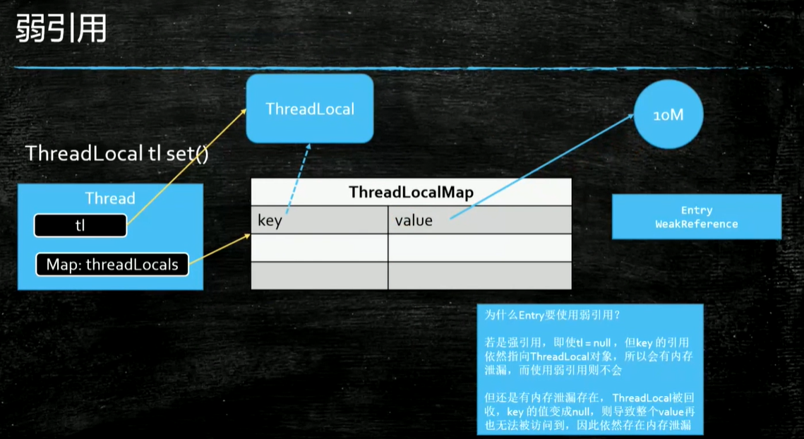

#### ThreadLocal
1. 并发量高的时候有可能内存溢出。
2. 线程结束后要手动回收资源。操作系统在回收线程或进程的时候，繁忙的时候不一定杀死线程或进程，只是会清除线程数据或进程数据。
3. 所有线程结束后此对象才能被回收。
4. cleanSomeSlots 启发式地扫描一些单元格，寻找过时的条目。当添加新元素或删除另一个过时元素时调用此方法。它执行对数级的扫描次数，作为不扫描(快速但保留垃圾)和与元素数量成比例的扫描次数之间的平衡，扫描次数会找到所有垃圾，但会导致一些插入花费O(n)时间。

#### Executor
是Runnable和Callable的调度容器，Future就是对于具体的调度任务的执行结果进行查看，最为关键的是Future可以检查对应的任务是否已经完成，也可以阻塞在get方法上一直等待任务返回结果。
Runnable和Callable的区别就是Runnable是没有结果可以返回的，就算是通过Future也看不到任务调度的结果的。
#### FutureTask
多用于耗时的计算，主线程可以在完成自己的任务后，再去获取结果。
1. 单独使用Runnable时：无法获得返回值。
2. 单独使用Callable时：无法在线程中(new Thread(Runnable r))使用，只能使用ExecutorService。Thread类只支持Runnable

FutureTask 实现了Runnable和Future，所以兼顾两者优点。既可以使用ExecutorService，也可以使用Thread。
#### Unsafe
1. Unsafe有可能在未来的JDK版本移除或者不允许Java应用代码使用，这一点可能导致使用了Unsafe的应用无法运行在高版本的JDK。
2. Unsafe的不少方法中必须提供原始地址(内存地址)和被替换对象的地址，偏移量要自己计算，一旦出现问题就是JVM崩溃级别的异常，会导致整个JVM实例崩溃，表现为应用程序直接crash掉。
3. Unsafe提供的直接内存访问的方法中使用的内存不受JVM管理(无法被GC)，需要手动管理，一旦出现疏忽很有可能成为内存泄漏的源头。