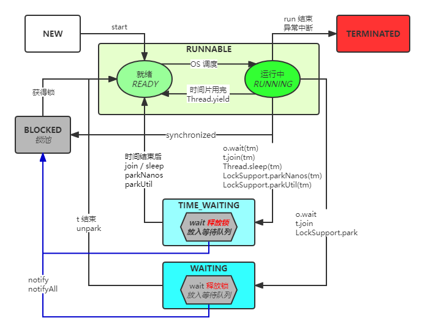

## 基础概念
进程是具有一定独立功能的程序的一次动态执行的过程，是操作系统进行资源分配和调度的一个独立单位，是应用程序运行的载体。  
线程是进程的最小执行单元，是进程的不同执行路径。(纤程/协程，线程中的线程，运行在用户空间，占用资源少。JVM 实现)
> 多进程和多线程的本质区别在于每个进程拥有自己的一整套变量，而线程则共享数据。

> **Java的线程是映射到操作系统的原生线程之上的**，如果要阻塞或唤醒一个线程，都需要操作系统来帮忙完成，这就需要从用户态转换到核心态中，因此状态转换需要耗费很多的处理器时间。
#### 守护线程，
指在程序运行的时候在后台提供一种通用服务的线程，比如垃圾回收线程就是一个很称职的守护者，并且这种线程并不属于程序中不可或缺的部分。因此，当所有的非守护线程结束时，程序也就终止了，同时会杀死进程中的所有守护线程。反过来说，只要任何非守护线程还在运行，程序就不会终止。

用户线程和守护线程两者几乎没有区别，唯一的不同之处就在于虚拟机的离开：如果用户线程已经全部退出运行了，只剩下守护线程存在了， 虚拟机也就退出了。因为没有了被守护者，守护线程也就没有工作可做了，也就没有继续运行程序的必要了。

将线程转换为守护线程可以通过调用Thread对象的setDaemon(true)方法来实现。在使用守护线程时需要注意一下几点：
1. thread.setDaemon(true)必须在thread.start()之前设置，否则会跑出一个IllegalThreadStateException异常。你不能把正在运行的常规线程设置为守护线程。
2. 在Daemon线程中产生的新线程也是Daemon的。
3. 守护线程应该永远不去访问固有资源，如文件、数据库，因为它会在任何时候甚至在一个操作的中间发生中断。
#### 创建线程
1. 实现Runnable接口。实现 void run()方法。
2. 继承Thread类。重写 void run()方法。
3. 线程池。实现 Callable 的 V call()方法

 实现Runnable接口的方式相对好些，首先Java是单继承，继承了Thread类之后就不能再继承其他业务类。但可以实现多个接口。从面向对象的思想考虑，线程任务是一个对象，线程是一个对象。

#### 启动线程
1. 启动线程 start()方法。直接调用run()方法就是方法调用。
2. run()结束 线程就结束了。
#### wait()和sleep()的区别
1. wait()是Object类的方法，sleep()是Thread类的方法。
2. wait()使用之前必须锁定对象，会释放这个对象的锁，要等着被唤醒，否则一直等待。sleep()抱着锁睡一定时间(如果需要锁 sleep本身是阻塞当前线程的执行，和锁没有直接关系)，自己唤醒。
#### main 主线程
JVM 的关闭是由是否还存在非守护线程决定。
1. 如果mian方法里创建的是守护线程，main 方法不等线程执行完成会提前结束。
2. junit测试时@test方法执行完就会终止所有用户线程。
#### 线程安全
当多个线程访问一个对象时，如果不用考虑这些线程在运行时环境下的调度和交替执行，也不需要进行额外的同步，或者在调用方法进行任何其他的协调操作，调用这个对象的行为都可以获得正确的结果，那这个对象是线程安全的。
> 互斥是因，同步是果；互斥是方法，同步是目的。

## 线程状态

#### 初始（NEW）
创建了一个线程对象，还没有调用start()方法。
#### 运行（RUNNABLE）
1. **就绪（READY）**  
就绪状态表示有资格运行，调度程序没有挑选到你，你就永远是就绪状态。
    1. 调用线程的start()方法，此线程进入就绪状态。
    2. 当前线程sleep()方法结束，其他线程join()结束，等待用户输入完毕，某个线程拿到对象锁，这些线程也将进入就绪状态。
    3. 当前线程时间片用完了，调用当前线程的yield()方法，当前线程进入就绪状态。
    4. 锁池里的线程拿到对象锁后，进入就绪状态。
2. **运行中（RUNNING）**  
就绪状态的线程被调度器选中获得 CPU 时间片后变为运行中状态。这是线程进入运行状态的唯一一种方式。
#### 阻塞（BLOCKED）
因为某种原因放弃了CPU 使用权。例如阻塞于锁。
#### 等待（WAITING）
进入该状态的线程需要等待其他线程做出一些特定动作（通知或中断）。
#### 超时等待（TIME_WAITING）
该状态不同于WAITING，它可以在指定的时间内自行返回。
##### 终止（TERMINATED）
表示该线程已经执行完毕。线程一旦死亡，就不能复生。  
在一个死去的线程上调用start()方法，会抛出java.lang.IllegalThreadStateException异常。
#### 阻塞状态
1. **普通阻塞**  
线程执行Thread.sleep(long ms)或t.join()方法，或者发出了I/O请求时，JVM会把该线程置为阻塞状态。
2. **等待阻塞**  
线程执行o.wait()方法，JVM会把该线程放入等待队列中。
3. **同步阻塞**  
线程在获取对象的同步锁时，若同步锁被别的线程占用，则JVM会把该线程放入锁池中；一个对象对应一个锁池。
> 锁和一般阻塞没有直接关系 不加锁 线程同样阻塞 阻塞的代码可以放到锁块里 也可以不放(没有竞争资源竞争就不用同步) wait() 方法比较特殊 不在sync内 编译失败
> 阻塞和CAS不同 Lock是基于CAS实现
#### 等待/唤醒

1. synchronized + wait/notify

   必须写在同步代码内 有先后顺序

2. Lock + Condition + wait/notify

   必须写在同步代码内 有先后顺序

   代码实现还是LockSupport

   可以多次调用newCondition()

3. LockSupport + park/unpark

   不需要在同步代码块 没有先后顺序 但是一个线程只能调用一次unpark()


#### Lost wake-up problem

调用obj的wait(), notify()方法前，必须获得obj锁，也就是必须写在synchronized(obj) 同步代码块内。
```
生产者
count+1
notify()
消费者
检查count值
睡眠或减一
初始的时候count等于0，这个时候消费者检查count的值，发现count小于等于0的条件成立；
就在这个时候，发生了上下文切换，生产者进来了一顿操作，把两个步骤都执行完了，也就是发出了通知，准备唤醒一个线程。
这个时候消费者刚决定睡觉，还没睡呢，所以这个通知就会被丢掉。消费者就睡过去了...
```


#### 方法对比

| 方法 | 所属类 | 说明 |
|---|---|---|
| sleep(long) | Thread | 当前线程调用，让出 CPU 给其他线程。不考虑其他线程的优先级，会给低优先级的线程运行的机会。当前线程阻塞，不释放锁，可中断，睡眠指定时间后自动苏醒进入可运行状态。 |
| yield() | Thread | 当前线程调用，让出CPU给其他线程。只能使同等优先级或更高优先级的线程有执行的机会。当前线程进入可运行状态，不释放锁。有可能让出CPU后马上执行。 |
| join() / join(long) | Thread | 当前线程调用其他线程的 join 方法。等待其他线程对象销毁，具有能使线程排队运行的作用。当前线程阻塞，不释放锁。 |
| wait() / wait(long) | Object | 当前线程调用，进入等待队列，释放锁。依靠notify()/notifyAll()唤醒或者wait(long timeout)timeout时间到自动唤醒。必须在synchronized(调用者) 同步代码块中使用。判断条件用while。 |
| notify() / notifyAll() | Object | 唤醒等待队列上的线程。notify选择是任意的；notifyAll唤醒所有此对象监视器上所有线程。必须在synchronized(调用者) 同步代码块中使用。判断条件用while。 |

#### 优雅的结束线程
1. volatile 字段标志位置
2. AtomicBoolean (依赖volatile属性)
3. isInterrupted 中断标记
> 都是一个标记 线程是否stop 业务自己判断 根据标记判断

## 并行和并发
并发是指任务提交，并行是指任务执行
并行是并发的子集，多CPU的情况。
