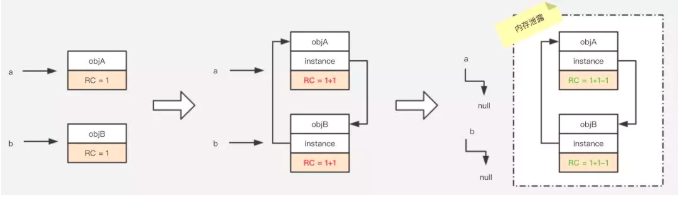
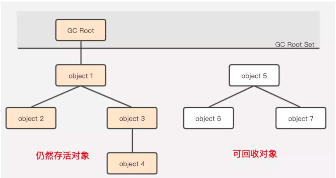
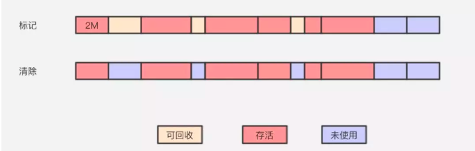
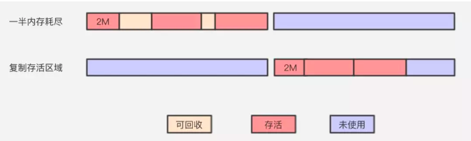
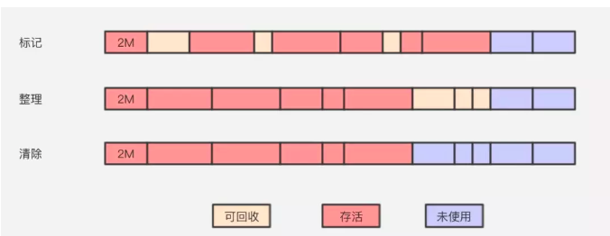
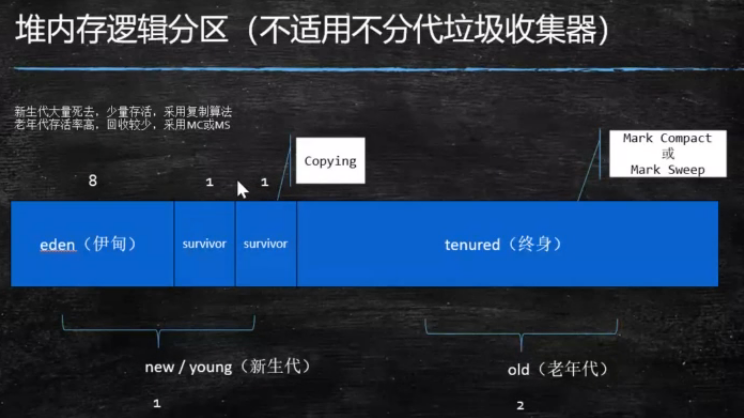

垃圾回收（Garbage Collection，GC），就是释放垃圾占用的空间，防止内存泄露。有效的使用可以使用的内存，对内存堆中已经死亡的或者长时间没有使用的对象进行清除和回收。

## 定义垃圾
#### 引用计数算法
通过在对象头中分配一个空间来保存该对象被引用的次数（Reference Count）。如果该对象被其它对象引用，则它的引用计数加1，如果删除对该对象的引用，那么它的引用计数就减1，当该对象的引用计数为0时，那么该对象就会被回收。  
引用计数算法是将垃圾回收分摊到整个应用程序的运行当中了，而不是在进行垃圾收集时，要挂起整个应用的运行，直到对堆中所有对象的处理都结束。因此，采用引用计数的垃圾收集不属于严格意义上的"Stop-The-World"的垃圾收集机制。


> 定义2个对象；相互引用；置空各自的声明引用。引用计数算法存在相互引用的问题。

#### 根可达分析算法
通过一些被称为引用链（GC Roots）的对象作为起点，从这些节点开始向下搜索，搜索走过的路径被称为（Reference Chain)，当一个对象到 GC Roots 没有任何引用链相连时（即从 GC Roots 节点到该节点不可达），则证明该对象是不可用的。



1. **虚拟机栈（栈帧中的本地变量表）中引用的对象**
    ```
    public class StackLocalParameter {
        public StackLocalParameter(String name) {}
    }
    
    public static void testGC() {
        StackLocalParameter s = new StackLocalParameter("localParameter");
        s = null;
    }
    ```
    s，即为 GC Root，当s置空时，localParameter 对象也断掉了与 GC Root 的引用链，将被回收。
2. **方法区中类静态属性引用的对象**
    ```
    public class MethodAreaStaticProperties {
        public static MethodAreaStaticProperties m;
        public MethodAreaStaticProperties(String name) {}
    }
    
    public static void testGC() {
        MethodAreaStaticProperties s = new MethodAreaStaticProperties("properties");
        s.m = new MethodAreaStaticProperties("parameter");
        s = null;
    }
    ```
    s 为 GC Root，s 置为 null，经过 GC 后，s 所指向的 properties 对象由于无法与 GC Root 建立关系被回收。而 m 作为类的静态属性，也属于 GC Root，parameter 对象依然与 GC root 建立着连接，所以此时 parameter 对象并不会被回收。
3. **方法区中常量引用的对象**
    ```
    public class MethodAreaStaticProperties {
        public static final MethodAreaStaticProperties m = new MethodAreaStaticProperties("final");
        public MethodAreaStaticProperties(String name) {}
    }
    
    public static void testGC() {
        MethodAreaStaticProperties s = new MethodAreaStaticProperties("staticProperties");
        s = null;
    }
    ```
    m 即为方法区中的常量引用，也为 GC Root，s 置为 null 后，final 对象也不会因没有与 GC Root 建立联系而被回收。
4. **本地方法栈中 JNI（即一般说的 Native 方法）引用的对象**  
任何 Native 接口都会使用某种本地方法栈，实现的本地方法接口是使用 C 连接模型的话，那么它的本地方法栈就是 C 栈。当线程调用 Java 方法时，虚拟机会创建一个新的栈帧并压入 Java 栈。然而当它调用的是本地方法时，虚拟机会保持 Java 栈不变，不再在线程的 Java 栈中压入新的帧，虚拟机只是简单地动态连接并直接调用指定的本地方法。

## 回收算法
#### 标记清除算法
Mark-Sweep是最基础的一种垃圾回收算法，它分为2部分，先把内存区域中的这些对象进行标记，哪些属于可回收标记出来，然后把这些垃圾拎出来清理掉。



> 算法相对简单；存活对象比较多的情况下效率较高（不适合Eden）。两次扫描（第一次GC Root标记，第二次清除），效率偏低；产生内存碎片。

#### 复制算法
Copying是在标记清除算法上演化而来，解决标记清除算法的内存碎片问题。它将可用内存按容量划分为大小相等的两块，每次只使用其中的一块。当这一块的内存用完了，就将还存活着的对象复制到另外一块上面，然后再把已使用过的内存空间一次清理掉。保证了内存的连续可用，内存分配时也就不用考虑内存碎片等复杂情况，逻辑清晰，运行高效。


> 适用于存活对象较少的情况；扫描一次，效率提高；没有碎片。空间浪费；移动复制对象，需要调整对象引用。

#### 标记整理算法
Mark-Compact标记过程仍然与标记清除算法一样，但后续步骤不是直接对可回收对象进行清理，而是让所有存活的对象都向一端移动，再清理掉端边界以外的内存区域。


> 不会产生碎片，方便对象分配；不会浪费空间。扫描两次，效率偏低。

## 分代算法
根据对象存活周期的不同一般是把 Java 堆分为新生代和老年代，这样就可以根据各个年代的特点采用最适当的收集算法。在新生代中，每次垃圾收集时都发现有大批对象死去，只有少量存活，那就选用复制算法，只需要付出少量存活对象的复制成本就可以完成收集。而老年代中因为对象存活率高、没有额外空间对它进行分配担保，就必须使用标记清除或标记整理算法来进行回收。



- **MinorGC/YGC**：年轻代空间耗尽时触发
- **MajorGC/FullGC**：在老年代无法继续分配空间时触发，新生代老年代同时进行回收
    1. System.gc()
    2. 老年代空间不足
    3. *方法区空间不足*
    4. 通过Minor GC后进入老年代的平均大小大于老年代的可用内存
    5. 由Eden区、From Space区向To Space区复制时，对象大小大于To Space可用内存，则把该对象转存到老年代，且老年代的可用内存小于该对象大小。

> 除Epsilon ZGC Shenandoah之外的GC都是使用逻辑分代模型  
> G1是逻辑分代，物理不分代  
> 除此之外不仅逻辑分代，而且物理分代

#### Eden 区
将近98%的对象是朝生夕死，所以针对这一现状，*大多数情况下*，对象会在新生代 Eden 区中进行分配，当 Eden 区没有足够空间进行分配时，虚拟机会发起一次 Minor GC，Minor GC 相比 Major GC 更频繁，回收速度也更快。通过 Minor GC 之后，Eden 会被清空，Eden 区中绝大部分对象会被回收，而那些无需回收的存活对象，将会进到 Survivor 的 From 区（若 From 区不够，则直接进入 Old 区）。
#### Survivor 区
Survivor 区相当于是 Eden 区和 Old 区的一个缓冲。Survivor 又分为2个区，一个是 From 区，一个是 To 区。每次执行 Minor GC，会将 Eden 区和 From 存活的对象放到 Survivor 的 To 区（如果 To 区不够，则直接进入 Old 区）。  
如果没有 Survivor 区，Eden 区每进行一次 Minor GC，存活的对象就会被送到老年代，老年代很快就会被填满。而有很多对象虽然一次 Minor GC 没有消灭，但其实也并不会蹦跶多久，或许第二次，第三次就需要被清除。Survivor 的存在意义就是减少被送到老年代的对象，进而减少 Major GC 的发生。Survivor 的预筛选保证，只有经历16次 Minor GC 还能在新生代中存活的对象，才会被送到老年代。
#### Old 区
老年代占据着2/3的堆内存空间，只有在 Major GC 的时候才会进行清理，每次 GC 都会触发“Stop-The-World”。内存越大，STW 的时间也越长，所以内存也不仅仅是越大就越好。由于复制算法在对象存活率较高的老年代会进行很多次的复制操作，效率很低，所以老年代这里采用的是标记清除或整理算法。以下几种情况也会进入老年代。
1. **大对象**  
指需要大量连续内存空间的对象，这部分对象不管是不是“朝生夕死”，都会直接进到老年代。这样做主要是为了避免在 Eden 区及2个 Survivor 区之间发生大量的内存复制。
2. **长期存活对象**  
虚拟机给每个对象定义了一个对象年龄（Age）计数器。正常情况下对象会不断的在 Survivor 的 From 区与 To 区之间移动，对象在 Survivor 区中每经历一次 Minor GC，年龄就增加1岁。当年龄增加到15岁时，这时候就会被转移到老年代。当然，这里的15，JVM 也支持进行特殊设置（0-15）。
- Parallel Scavenge 15
- CMS 15
- G1 15
3. [**动态对象年龄**](https://www.jianshu.com/p/989d3b06a49d)  
如果 Survivor 空间中相同年龄所有对象大小的总合大于 Survivor 空间的一半，年龄大于等于该年龄的对象就可以直接进去老年区，无需等你成年。
- [**空间分配担保**](https://cloud.tencent.com/developer/article/1082730)  
YGC期间 survivor区空间不够了；空间担保直接进入老年代。

#### 对象分配

