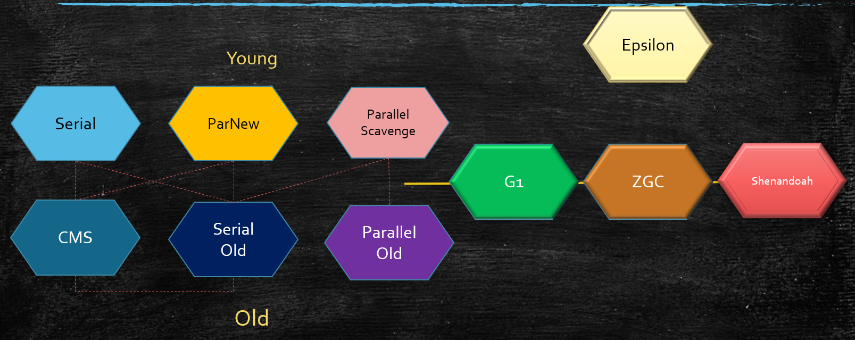
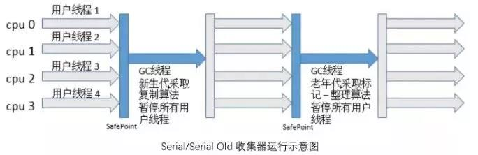
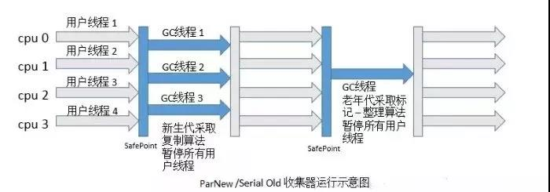
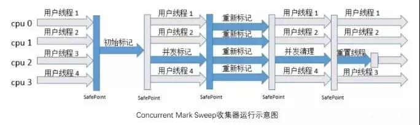
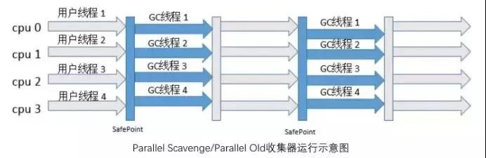
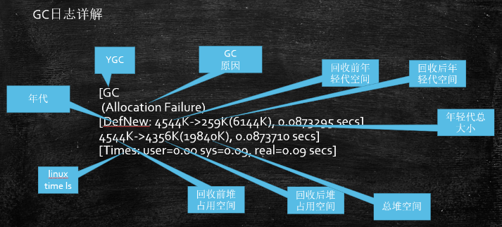
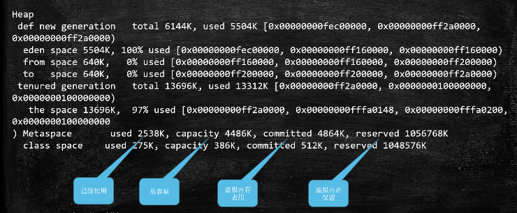

#### 安全点
安全点是在程序执行期间的所有GC Root已知并且所有堆对象的内容一致的点。当线程运行到这类位置时，堆对象状态是确定一致的，JVM可以安全地进行操作，如GC，偏向锁解除等。

## 新生代收集器
#### Serial
新生代的单线程收集器，采用复制算法进行垃圾收集。Serial 进行垃圾收集时，不仅只用一条线程执行垃圾收集工作，它在收集的同时，所有的用户线程必须暂停（Stop The World）。


> Client 模式默认新生代收集器；单核服务器效率最高。
#### ParNew
就是一个 Serial 的多线程版本，其它与Serial并无区别。ParNew 在单核 CPU 环境并不会比 Serial 收集器达到更好的效果，它默认开启的收集线程数和 CPU 数量一致，可以通过 -XX:ParallelGCThreads 来设置垃圾收集的线程数。


> 响应时间优先。多核服务器；与 CMS 收集器搭配使用，Parallel Scavenge的变种。  
> -XX:ParallelGCThreads 来设置垃圾收集的线程数
#### Parallel Scavenge
用于新生代的多线程收集器，与 ParNew 的不同之处是ParNew 的目标是尽可能缩短垃圾收集时用户线程的停顿时间，Parallel Scavenge 的目标是达到一个可控制的吞吐量。  
吞吐量就是 CPU 执行用户线程的的时间与 CPU 执行总时间的比值【吞吐量 = 运行用户代代码时间/（运行用户代码时间+垃圾收集时间）】，比如虚拟机一共运行了 100 分钟，其中垃圾收集花费了 1 分钟，那吞吐量就是 99% 。

> Server 模式默认新生代收集器。吞吐量优先
> -XX:MaxGCPauseMillis 来设置收集器尽可能在多长时间内完成内存回收  
> -XX:GCTimeRatio 来精确控制吞吐量

## 老年代收集器
#### Serial Old
Serial 的老年代版本，同样是一个单线程收集器，采用**标记整理**算法。
> 与 Parallel Scavenge 收集器搭配；作为 CMS 收集器的后备预案。
#### CMS（Concurrent Mark Sweep）
CMS 收集器是一种以最短回收停顿时间为目标的收集器，以最短用户线程停顿时间著称。高响应低停顿；降低STW的时间(200ms)
1. **初始标记**  
标记一下 GC Roots 能直接关联到的对象，速度较快。
2. **并发标记**  
进行 GC Roots Tracing，标记出全部的垃圾对象，耗时较长。
3. **重新标记**  
修正并发标记阶段引用户程序继续运行而导致变化的对象的标记记录，耗时较短。
4. **并发清除**  
用标记-清除算法清除垃圾对象，耗时较长。



整个过程耗时最长的并发标记和并发清除都是和用户线程一起工作，总体上来说，CMS 收集器垃圾收集可以看做是和用户线程并发执行的。**初始标记和重新标记会STW**。
1. **CPU 资源敏感**  
默认分配的垃圾收集线程数为（CPU 数+3）/4，随着 CPU 数量下降，占用 CPU 资源越多，吞吐量越小。
2. **浮动垃圾**  
在并发清理阶段，由于用户线程还在运行，还会不断产生新的垃圾，CMS 收集器无法在当次收集中清除这部分垃圾。同时由于在垃圾收集阶段用户线程也在并发执行，CMS 收集器不能像其他收集器那样等老年代被填满时再进行收集，需要预留一部分空间提供用户线程运行使用。当 CMS 运行时，预留的内存空间无法满足用户线程的需要，就会出现 “ Concurrent Mode Failure ”的错误，这时将会启动后备预案，临时用 Serial Old 来重新进行老年代的垃圾收集。
3. **空间碎片**  
CMS 是基于标记清除算法，所以垃圾回收后会产生空间碎片。
> -XX:UserCMSCompactAtFullCollection 开启碎片整理（默认开启），在 CMS 进行 Full GC 之前，会进行内存碎片的整理。  
> -XX:CMSFullGCsBeforeCompaction 设置执行多少次不压缩（不进行碎片整理）的 Full GC 之后，跟着来一次带压缩（碎片整理）的 Full GC。  
> 重视服务器响应速度，要求系统停顿时间最短。
##### 标记算法 三色标记 + Incremental Update

#### Parallel Old | PS MarkSweep
Parallel Scavenge 的老年代版本，是一个多线程收集器，采用标记整理算法。可以与 Parallel Scavenge 收集器搭配，可以充分利用多核 CPU 的计算能力。



## 堆内存收集器
#### G1(10ms)
##### 标记算法：三色标记 + SATB
#### ZGC (1ms) PK C++
##### 标记算法：ColoredPointers + LoadBarrier
#### Shenandoah
##### 标记算法：ColoredPointers + WriteBarrier
#### Eplison

## 总结
JDK诞生 Serial追随；为了提高效率，诞生了PS；为了配合CMS，诞生了PN；CMS是1.4版本后期引入，CMS是里程碑式的GC，它开启了并发回收的过程，但是CMS毛病较多，因此目前任何一个JDK版本默认是CMS并发垃圾回收是因为无法忍受STW。
- 垃圾收集器跟内存大小的关系
    1. Serial 几十兆
    2. PS 上百兆 - 几个G
    3. CMS - 20G
    4. G1 - 上百G
    5. ZGC - 4T - 16T（JDK13）
- [PS和PN区别](https://docs.oracle.com/en/java/javase/13/gctuning/ergonomics.html#GUID-3D0BB91E-9BFF-4EBB-B523-14493A860E73)
- JDK 1.8 默认的垃圾回收器：ParNew + ParallelOld(PS MarkSweep)
- Linux中没找到默认GC的查看方法，而windows中会打印UseParallelGC。 java +XX:+PrintCommandLineFlags -version
- 内存泄漏memory leak 内存溢出out of memory

| 参数 | 新生代+老年代收集器 |
|---|---|
| -XX:+UseSerialGC | Serial+Serial Old |
| -XX:+UseParNewGC | ParNew+Serial Old |
| -XX:+UseParallelGC | **Parallel Scavenge+PS MarkSweep** |
| -XX:+UseParallelOldGC | Parallel Scavenge+Parallel Old |
| -XX:+UseConcMarkSweepGC | ParNew+CMS+Serial Old |
| -XX:+UseG1GC | G1  |

## GC日志
每种垃圾回收器的日志格式是不同的。PS GC日志如下：



heap dump部分
```
eden space 5632K, 94% used [0x00000000ff980000,0x00000000ffeb3e28,0x00000000fff00000)
        后面的内存地址指的是:起始地址            使用空间结束地址    整体空间结束地址
```


total = eden + 1个survivor