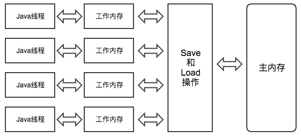

## JMM
Java 内存模型规定了所有的变量都存储在主内存（Main Memory）中，此外每条线程还有自己的工作内存（Working Memory）。  
线程的工作内存中保存了被该线程使用到的变量的主内存副本拷贝，线程对变量的所有操作（读取、赋值等）都必须在工作内存中进行，不能直接读写主内存中的变量。
并且，不同的线程之间也无法直接访问对方工作内存中的变量，线程间变量值得传递均需要通过主内存来完成。  
这里说的变量包括实例字段、静态字段和构成数组对象的元素，不包括局部变量与方法参数，因为后者是线程私有的，不会共享，也就不存在竞争的问题。  
可以把这里的主内存与工作内存概念与JVM运行时数据区进行对应，主内存主要对应Java堆中的对象实例数据部分，工作内存对应于虚拟机栈中的部分区域。



八大原子操作（最新的JSR-133已经放弃这种描述）

| 动作 | 作用 |
|---|---|
| lock（锁定） | 作用于主内存变量，把一个变量标示为一条线程独占的状态 |
| unlock（解锁） | 作用于主内存的变量，把一个处于锁定状态的变量释放出来，释放后的变量才可以被其他线程锁定 |
| read（读取） | 作用于主内存的变量，把一个变量的值从主内存传输到线程的工作内存中，以便随后的load动作使用 |
| load（载入） | 作用于工作内存的变量，把read操作从主存中得到的变量值放入工作内存的变量副本中 |
| use（使用） | 作用于工作内存的变量，把工作内存中一个变量的值传递给执行引擎，每当虚拟机遇到一个需要使用到变量的值的字节码指令时将会执行这个操作 |
| assign（赋值） | 作用于工作内存的变量，把一个从执行引擎接收到的值赋给工作内存中的变量，每当虚拟机遇到一个给变量赋值的字节码指令时执行这个操作 |
| store（存储） | 作用于工作内存的变量，把工作内存中一个变量的值传送到主内存中，以便随后的write操作使用 |
| write（写入） | 作用于主内存的变量，把store操作从工作内存中得到的变量的值放入主内存的变量中 |
1. 不允许read和load、store和write操作之一单独出现，以上两个操作必须按顺序执行，但没有保证必须连续执行，也就是说，read与load之间、store与write之间是可插入其他指令的。
2. 不允许一个线程丢弃它的最近的assign操作，即变量在工作内存中改变了之后必须把该变化同步回主内存。
3. 不允许一个线程无原因地（没有发生过任何assign操作）把数据从线程的工作内存同步回主内存中。
4. 一个新的变量只能从主内存中诞生，不允许在工作内存中直接使用一个未被初始化（load或assign）的变量，换句话说就是对一个变量实施use和store操作之前，必须先执行过了assign和load操作。
5. 一个变量在同一个时刻只允许一条线程对其执行lock操作，但lock操作可以被同一个条线程重复执行多次，多次执行lock后，只有执行相同次数的unlock操作，变量才会被解锁。
6. 如果对一个变量执行lock操作，将会清空工作内存中此变量的值，在执行引擎使用这个变量前，需要重新执行load或assign操作初始化变量的值。
7. 如果一个变量实现没有被lock操作锁定，则不允许对它执行unlock操作，也不允许去unlock一个被其他线程锁定的变量。
8. 对一个变量执行unlock操作之前，必须先把此变量同步回主内存（执行store和write操作）。
> volatile 保证了read、load、use的顺序和连续行，同理assign、store、write也是顺序和连续的。也就是这几个动作是原子性的。
#### happens-before(JLS 17.4.5)
1. 程序次序规则：在一个线程内，按照程序代码顺序，书写在前面的操作先行发生于书写在后面的操作。准确地说，应该是控制流顺序而不是程序代码顺序，因为要考虑分支、循环等结构。
2. 管程锁定规则：一个unlock操作先行发生于后面对同一个锁的lock操作。
3. volatile 变量规则：对一个volatile变量的写操作先行发生于后面对这个变量的读操作。
4. 线程启动规则：Thread对象的start()方法先行发生于此线程的每一个动作。
5. 线程终止规则：线程中所有的操作都先发生于对线程的终止检测，我们可以通过Thread.join()方法结束、Thread.isAlive()的返回值等手段检测到线程已经终止执行。
6. 线程中断规则：对线程interrupt()方法的调用先行发生于被中断线程的代码检测到中断事件的发生，可以通过Thread.interrupted()方法检测到是否有中断发生。
7. 对象终结规则：一个对象的初始化完成先行发生于它的finalize()方法的开始。
8. 传递性：如果操作A先行发生于操作B，操作B先行发生于操作C，那就可以得出操作A先行发生于操作C的结论。
>  Java 语言的要求，让JVM去实现。
#### as-if-serial
所有的动作(Action)都可以为了优化而被重排序，但是必须保证它们重排序后的结果和程序代码本身的应有结果是一致的。Java编译器、运行时和处理器都会保证单线程下的as-if-serial语义。
> 为了保证这一语义，重排序不会发生在有数据依赖的操作之中。

## 硬件层数据一致性
- 总线锁
- 一致性协议。  
*intel用[MESI](https://www.cnblogs.com/z00377750/p/9180644.html)（Modified Exclusive Shared Invalid）  
CPU中每个缓存行（cache line）使用4种状态进行标记（使用额外的两位(bit)表示）* **读取缓存以cache line为基本单位，目前64字节；使用缓存行的对齐能够提高效率。**
> 现代CPU的数据一致性实现 = 缓存锁(MESI ...) + 总线锁（数据很大，缓存不了）
#### 乱序问题
CPU为了提高指令执行效率，会在一条指令执行过程中（比如去内存读数据（慢100倍）），去同时执行另一条指令，前提是，两条指令没有依赖关系。
- [合并写技术](https://www.cnblogs.com/liushaodong/p/4777308.html)  
WCBuffer：比L1、L2还快；CPU中只有4个字节。

## 如何保障有序性
#### 1.硬件级别
- 原子指令，如x86上的"lock …" 指令是一个Full Barrier，执行时会锁住内存子系统来确保执行顺序，甚至跨多个CPU。Software Locks通常使用了内存屏障或原子指令来实现变量可见性和保持程序顺序。
- 硬件CPU内存屏障（X86）：在两条指令之间加内存屏障。
    1. sfence: store | 在sfence指令前的写操作当必须在sfence指令后的写操作前完成。
    2. lfence：load | 在lfence指令前的读操作当必须在lfence指令后的读操作前完成。
    3. mfence：mix | 在mfence指令前的读写操作当必须在mfence指令后的读写操作前完成。
- 内存屏障作用
    1. 阻止屏障两侧的指令重排序。
    2. 强制把写缓冲区/高速缓存中的数据写回主内存，让缓存中相应的数据失效。
    > 在指令前插入Load Barrier，可以让高速缓存中的数据失效，强制从新从主内存加载数据。  
     在指令后插入Store Barrier，能让写入缓存中的最新数据更新写入主内存，让其他线程可见。

#### 2.JVM规范（JSR133）
- LoadLoad屏障  
语句：Load1; LoadLoad; Load2  
在Load2及后续读取操作要读取的数据被访问前，保证Load1要读取的数据被读取完毕。
- StoreStore屏障  
语句：Store1; StoreStore; Store2  
在Store2及后续写入操作执行前，保证Store1的写入操作对其它处理器可见。
- LoadStore屏障  
语句：Load1; LoadStore; Store2  
在Store2及后续写入操作被刷出前，保证Load1要读取的数据被读取完毕。
- StoreLoad屏障  
语句：Store1; StoreLoad; Load2  
在Load2及后续所有读取操作执行前，保证Store1的写入对所有处理器可见。  
它的开销是四种屏障中最大的。在大多数处理器的实现中，这个屏障是个万能屏障，兼具其它三种内存屏障的功能。
1. **volatile**
    1. 字节码层面：ACC_VOLATILE
    2. JVM层面：volatile内存区的读写都加屏障
       ``` 
       StoreStoreBarrier  
       volatile 写操作  
       StoreLoadBarrier
    
       LoadLoadBarrier  
       volatile 读操作  
       LoadStoreBarrier  
       ```
    3. [OS和硬件层面](https://blog.csdn.net/qq_26222859/article/details/52235930)
   hsdis: HotSpot Dis Assembler  
   windows: lock 指令实现
2. **synchronized**
    1. 字节码层面：ACC_SYNCHRONIZED 和 monitorenter monitorexit
    2. JVM层面：C/C++ 调用了操作系统提供的同步机制
    3. [OS和硬件层面](https://blog.csdn.net/21aspnet/article/details/88571740)  
       x86: lock cmpxchg / xxx
