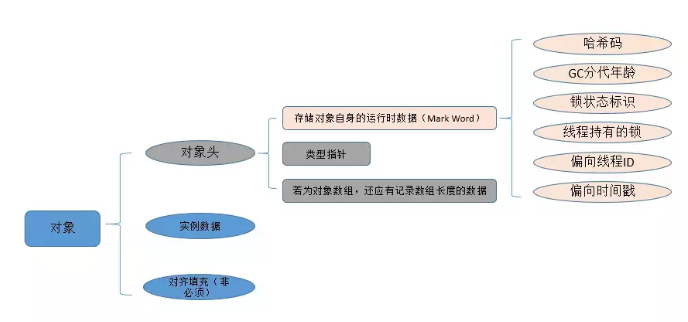
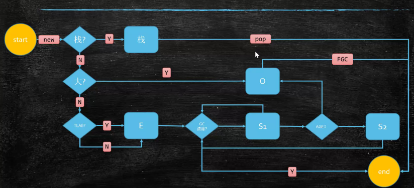
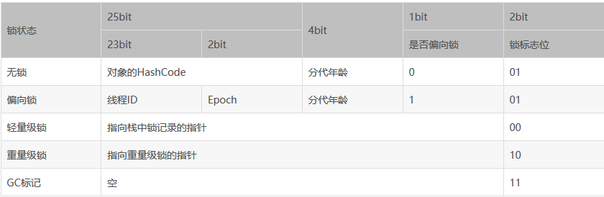
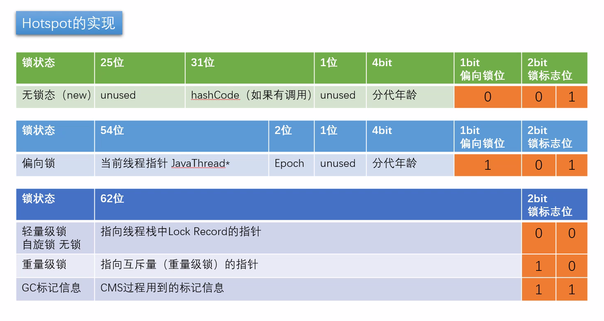
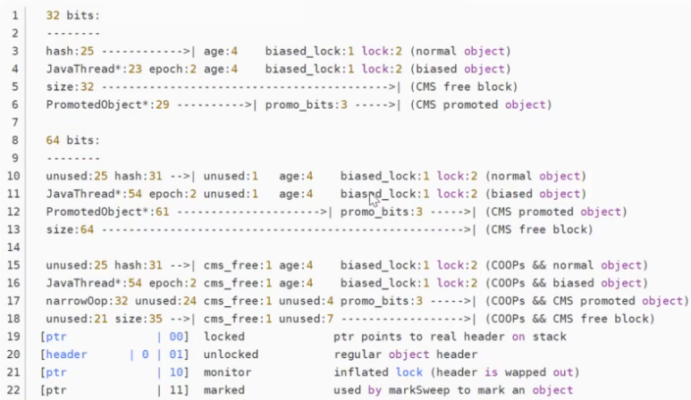

## 对象内存布局
### 1.创建过程
1. class loading
2. class linking
3. class initializing（`<cinit>` 静态代码块）
4. 申请对象内存
5. 成员变量赋默认值
6. 调用构造方法`<init>`
    1. 成员变量顺序赋初始值
    2. 执行构造方法语句
#### 2.对象内存大小
*查看JVM默认规则：java -XX:+PrintCommandLineFlags -version*


- **普通对象**
1. **对象头**
    1. markword：8字节
    2. ClassPointer指针：-XX:+UseCompressedClassPointers 为4字节；不开启为8字节。  
    对象指向它的类元数据的指针，虚拟机通过这个指针来确定这个对象是哪个类的实例
2. **实例数据**：存放类的属性数据信息，包括父类的属性信息
    
    1. 引用类型：-XX:+UseCompressedOops 为4字节；不开启为8字节。
    2. Oops Ordinary Object Pointers 普通对象指针
        1. 每个Class的属性指针（静态成员变量）
        1. 每个对象的属性指针
        3. 普通对象数组的每个元素指针  
        压缩也不是万能的，针对一些特殊类型的指针，JVM是不会优化的。  
        比如指向PermGen的Class对象指针，本地变量，堆栈元素，入参，返回值，NULL指针不会被压缩。
    
    hotspot开启内存压缩的规则（64位/内存并不是越大越好）
    1. 4G以下，直接砍掉高32位
    2. 4G - 32G，默认开启内存压缩 ClassPointers Oops
    3. 32G，压缩无效，使用64位
3. **Padding对齐**  
    虚拟机要求对象起始地址必须是8字节的整数倍。填充数据不是必须存在的，仅仅是为了字节对齐。
- **数组对象**
1. 对象头比普通对象多了一个数据长度 4字节
2. 数组每个元素数据
#### 3.[对象定位](https://blog.csdn.net/clover_lily/article/details/80095580)
1. 句柄池  
划分出一块内存来作为句柄池。引用中存储的是稳定的句柄地址，在对象被移动时只会改变句柄中的实例数据指针，而引用本身不需要被修改。GC 效率高。
2. 直接指针  
速度相对快，节省了一次指针定位的时间开销；Hotspot实现。
#### 4.对象分配

- **栈上分配**
    1. 线程私有小对象
    2. 无逃逸
    3. 支持标量替换  
    标量即不可被进一步分解的量，而JAVA的基本数据类型就是标量（如：int，long等基本数据类型以及reference类型等）
    ```
    class Obj {
        private int a;
        private int b;
    }
    可以用 int a, b; 代替整个对象。
    ```
- **线程本地分配TLAB**(Thread Local Allocation Buffer)
    1. 占用Eden，默认1%
    2. 多线程的时候不用竞争Eden就可以申请空间，提高效率
    3. 小对象
- **老年代**  
大对象
- **Eden区**

## MarkWord
32 位结构如下  




32 位与64位区别



#### hashcode
当一个对象已经计算过 identityHashCode 它就无法进入偏向锁状态。  
当调用锁对象的 object.hashcode() 或 System.identityHashCode(object)方法会导致该对象偏向锁或轻量级锁升级。  
因为在Java中一个对象的hashcode是在调用这两个方式时才生成的，如果是无锁状态则存在 markword 中，如果是重量级锁则存放在对象的monitor中，而偏向锁或轻量级锁是没有地方能存放该信息的，所以必须升级。

31位的的hashcode；System.identityHashCode(...) 根据原始内容计算的。hashcode 重写过的不会记在这里。  
如果对象没有重写hashcode方法，默认调用 OS::random 产生hashcode，可以使用 System.identityHashCode(...) 获取。  
OS::random 产生规则为 next_rand=(16807) mod (2*31 - 1) 因此可以使用31位存储；一旦生成了hashcode，JVM会记录在markword中。

[相关文档](https://cloud.tencent.com/developer/article/1480590)
[相关文档](https://cloud.tencent.com/developer/article/1484167)
[相关文档](https://cloud.tencent.com/developer/article/1485795)
[相关文档](https://cloud.tencent.com/developer/article/1482500)