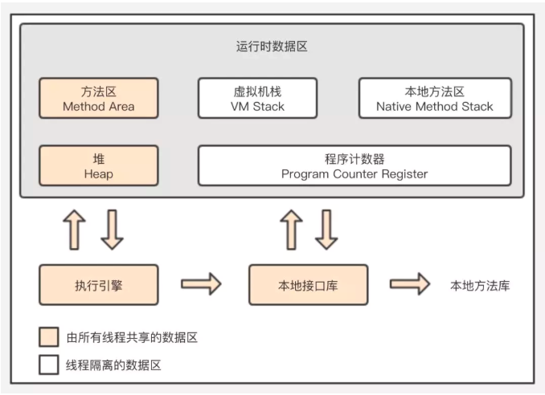
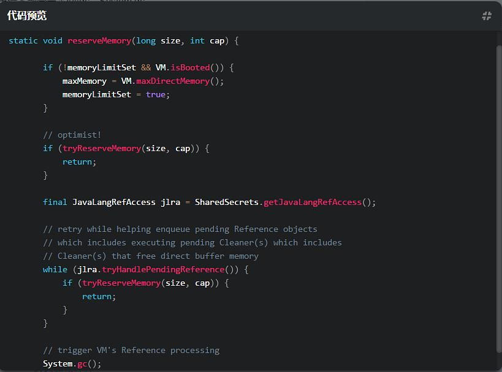

## 运行时数据区


| 名称 | 特性                                                               | 作用 | 参数             | 异常 |
|---|------------------------------------------------------------------|---|----------------|---|
| 程序计数器 | 线程私有，生命周期与线程相同，占用内存小。                                            | 当前线程所执行的字节码的行号指示器。为了线程切换后能恢复到正确的执行位置。本地（native）方法，计数器值则为空。| 无              | 无 |
| 虚拟机栈 | 线程私有，生命周期与线程相同，使用**连续的内存空间**。默认每个线程1MB（JDK1.5）。HotSpot的栈不可以动态扩展。 | 方法执行的内存模型，存储**局部变量表**、**操作数栈**、**动态链接**、**方法出口**等信息。| -Xss           | StackOverflowError OutOfMemoryError |
| 本地方法栈 | HotSpot实现和虚拟机栈合二为一                                               | 执行本地方法。|                |  |
| 堆 | 线程共享，生命周期与虚拟机相同，可以不使用连续的内存地址。                                    | 保存实例，大多数对象实例（包括数组）常量、静态变量、都在堆上分配。GC主要区域。（逃逸技术、标量替换技术带来栈上分配、TLAB实例）| -Xms -Xmx -Xmn | OutOfMemoryError |
| 方法区 | 线程共享，生命周期与虚拟机相同，可以不使用连续的内存地址。                                    | 存储已被虚拟机加载的类信息、即时编译器编译后的代码等数据。|                | OutOfMemoryError |
| *运行时常量池* | **方法区的一部分**，具有动态性。                                               | 存放字面量及符号引用。运行期间也可将新的常量放到池中，利用String类的intern()方法。 |                |  |

#### 程序计数器（PC）
虚拟机的运行，类似于这样的循环：
```
while ( not end ) {
    取PC中的位置，找到对应位置的指令；
    执行该指令；
    PC ++;
}
```
#### 虚拟机栈（VM Stack）
每一个线程有一个虚拟机栈。一个方法对应一个栈帧。  
**栈帧**Frame  
支持虚拟机进行方法调用和方法执行的数据结构，虚拟机栈的栈元素。每个方法从调用开始至执行完成的过程，都对应着一个栈帧在虚拟机栈里面从入栈到出栈的过程。  
局部变量表的大小，操作数栈的深度在编译时期已经确定了，写入到方法表的Code属性之中；运行期间不会改变。
1. 局部变量表 Local Variable Table  
虚拟机通过索引定位方式使用局部变量表，索引n代表使用第n个slot。  
实例方法，下标0为隐式参数this；然后形参；然后方法体内的局部变量。  
*局部变量和成员变量不一样；没有默认值。编译期会检查*。
2. 操作数栈 Operand Stack  
32位数据类型所占的栈容量为1，64位数据类型所占的栈容量为2。  
操作数栈共享区域：在概念模型中，两个栈帧作为虚拟机栈的元素，是完全相互独立的。但是大多虚拟机的实现都会做一些优化处理，令两个栈帧出现一部分重叠；无须进行额外的参数复制传递。  
*Java虚拟机的解释执行引擎称为基于栈的执行引擎，栈指的就是操作数栈*。  
对于long的处理（store and load），多数虚拟机的实现都是原子的；jls 17.7，没必要加volatile。
3. [动态链接](https://blog.csdn.net/qq_41813060/article/details/88379473) Dynamic Linking  
class文件的常量池中存有大量的符号引用，字节码中的方法调用指令就以常量池中指向方法的符号引用作为参数。这些符号引用一部分会在类加载阶段或者第一次使用的时候就转化为直接引用，称为静态解析。  
解析的前提是：方法在程序真正运行之前就是一个可确定的调用版本，并且这个方法的调用版本在运行期是不可改变的。换句话说，调用目标在编译时就必须确定下来。主要包括静态方法和私有方法两大类。  
另外一部分将在每一次运行期间转化为直接引用（方法在实际运行时内存布局入口地址），这部分称为动态链接。  
jvms 2.6.3
4. 方法返回地址 return address  
a() -> b()，方法a调用了方法b, b方法的返回值放在什么地方。  
方法退出的过程实际上就等同于把当前栈帧出栈，因此退出时可能执行的操作有：恢复上层方法的局部变量表和操作数栈，把返回值（如果有的话）压入调用者栈帧的操作数栈中，调整PC计数器的值以指向方法调用指令后面的一条指令等。
#### 方法区
JVM规范中定义的一种概念上的区域，具有什么功能，但并没有规定这个区域到底应该位于何处。HotSpot方法区实现如下：
- **永久代（PermGen space）**  
JDK1.8之前。必须指定大小限制，不能动态指定。对于动态生成类的情况比较容易出现永久代的内存溢出。  
垃圾收集行为在这个区域很少出现的，主要回收目标是针对常量池和类型的卸载。
- **元空间（Metaspace）**  
JDK1.8开始。JVM架构的改造将类元数据放到本地内存中，**常量池和静态变量放到Java堆**。一定程度上解决了原来在运行时生成大量类造成经常Full GC问题，如运行时使用反射、代理等。
元空间并不在虚拟机中，而是使用本地内存。
1. -XX:MetaspaceSize  
初始空间大小，达到该值就会触发垃圾收集进行类型卸载，同时GC会对改值进行调整。  
如果释放了大量的空间，就适当降低该值；如果释放了很少的空间，那么在不超过MaxMetaspaceSize时，适当提高该值。
2. -XX:MaxMetaspaceSize  
最大空间，默认是没有限制的（受限于物理内存）。

## 直接（堆外）内存
NIO的Buffer提供了一个可以不经过JVM内存直接访问系统物理内存的类DirectBuffer。DirectBuffer类继承自ByteBuffer，但和普通的ByteBuffer不同，普通的ByteBuffer仍在JVM堆上分配内存，其最大内存受到最大堆内存的限制；而DirectBuffer直接分配在物理内存中，并不占用堆空间，其可申请的最大内存受操作系统限制。直接内存的读写操作比普通Buffer快，但它的创建、销毁比普通Buffer慢（猜测原因是DirectBuffer需向OS申请内存涉及到用户态内核态切换，而后者则直接从堆内存划内存即可）。因此直接内存使用于需要大内存空间且频繁访问的场合，不适用于频繁申请释放内存的场合。

DirectBuffer并没有真正向OS申请分配内存，其最终还是通过调用Unsafe的allocateMemory()来进行内存分配。不过JVM对Direct Memory可申请的大小也有限制，可用-XX:MaxDirectMemorySize=1M设置，这部分内存不受JVM垃圾回收管理。因为 DirectByteBuffer 对象有可能长时间存在于堆内内存，所以它很可能晋升到 JVM 的老年代，所以这时候 DirectByteBuffer 对象的回收需要依赖 Old GC 或者 Full GC 才能触发清理。如果长时间没有 Old GC 或者 Full GC 执行，那么堆外内存即使不再使用，也会一直在占用内存不释放，很容易将机器的物理内存耗尽，这是相当危险的。那么在使用 DirectByteBuffer 时我们如何避免物理内存被耗尽呢？因为 JVM 并不知道堆外内存是不是已经不足了，所以我们最好通过 JVM 参数 -XX:MaxDirectMemorySize 指定堆外内存的上限大小，当堆外内存的大小超过该阈值时，就会触发一次 Full GC 进行清理回收，如果在 Full GC 之后还是无法满足堆外内存的分配，那么程序将会抛出 OOM 异常。

此外在 ByteBuffer.allocateDirect 分配的过程中，如果没有足够的空间分配堆外内存，在 Bits.reserveMemory 方法中也会主动调用 System.gc() 强制执行 Full GC，但是在生产环境一般都是设置了 -XX:+DisableExplicitGC，System.gc() 是不起作用的，所以依赖 System.gc() 并不是一个好办法。

与在JVM堆分配内存(allocate)相比，直接内存分配（allocateDirect）的访问性能更好，但分配较慢。（一般如此，当然数据量小的话差别不是那么明显）  
ByteBuffer是通过Java的代码申请的，而且是有引用的在堆里的。所以并算不上不完全不受GC的影响。它的申请这些操作底层控制的内存，确实是GC并不能回收，假如我们申请了ByteBuffer，但是没有释放，那岂不是内存泄露了，所以Java的GC这时候发挥作用了，在堆中的对象没有引用了，GC的时候可以回收Java的对象，但是这个对象相当于直接内存的代表，当代表可以被GC的时候，他也会调用Java的代码去释放这块内存，最终达到释放的目的，避免影响。
```
((DirectBuffer)byteBuffer).cleaner().clean();
```
在元数据区OOM之前，通常垃圾收集器会被触发；尽可能去清理空间；FullGC(java.nio.Bits.reserveMemory)—System.gc()



## 堆内存分配
1. 指针碰撞
2. 空闲列表